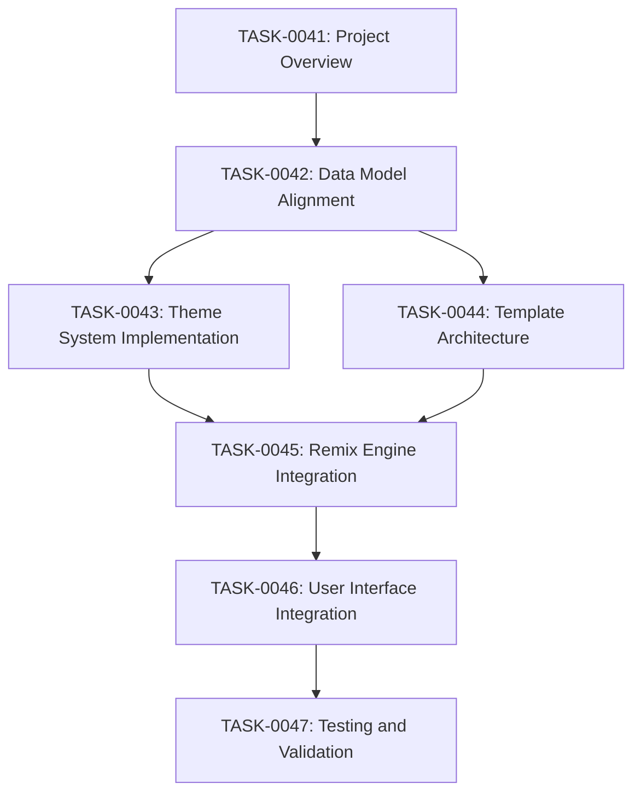

# Travel Proposal Remix System - Task Breakdown

## Overview
This directory contains detailed task specifications for implementing a comprehensive travel proposal rendering system with template remixing capabilities. The system will provide 4 base templates that can be styled with multiple theme combinations, creating hundreds of possible proposal variations without template duplication.

## Task Dependencies and Execution Order

## Task Summary

### Core Infrastructure
- **TASK-0041**: Project coordination and acceptance criteria
- **TASK-0042**: Data models alignment with proposal schema (1-2 hours)
- **TASK-0043**: Theme system with colors, typography, decorations (2-3 hours)

### Template System  
- **TASK-0044**: Modular template architecture with 4 base layouts (2-3 hours)
- **TASK-0045**: Remix engine integration for dynamic combinations (1-2 hours)

### User Experience
- **TASK-0046**: MCP tool interface and preset system (1 hour)
- **TASK-0047**: Comprehensive testing and validation (2-3 hours)

**Total Estimated Time: 9-14 hours**

## Expected Outcomes

### Template Types
1. **Detailed**: Comprehensive proposal with all sections
2. **Condensed**: Executive summary format
3. **Fancy**: Premium presentation for luxury travel  
4. **Functional**: Clean minimal design

### Style Presets
1. **Professional**: Blue corporate theme, no decorations
2. **Luxury**: Gold elegant theme, minimal emoji
3. **Modern**: Teal contemporary theme with icons
4. **Friendly**: Orange theme with rich emoji
5. **Executive**: Minimal gray for quick decisions

### System Capabilities
- **320+ Combinations**: 4 templates × 5 colors × 4 typography × 4 decorative styles
- **Professional Quality**: Web-ready HTML suitable for client viewing
- **Performance**: Sub-500ms generation time per proposal
- **Backward Compatibility**: Existing proposal generation continues to work

## Implementation Notes

### Technical Constraints
- Uses custom template engine (no Nunjucks due to Cloudflare Workers eval() restrictions)
- Maintains current D1 Database integration
- CSS-in-JS approach for dynamic theming
- Responsive design for all devices

### Quality Standards
- All HTML validates correctly
- Professional visual appearance
- Mobile-responsive layouts
- Print-friendly styles
- Performance optimized

## Getting Started

1. **Prerequisites**: Complete current template rendering system (TASK-0035)
2. **Start with**: TASK-0042 (Data Model Alignment) - foundational changes
3. **Parallel work**: TASK-0043 and TASK-0044 can be worked on simultaneously after TASK-0042
4. **Integration**: TASK-0045 brings everything together
5. **Polish**: TASK-0046 and TASK-0047 provide user experience and validation

## Success Metrics

- Generate professional proposals with multiple visual styles
- Easy theme switching without template duplication  
- Client-ready HTML output for web publishing
- Travel agent-friendly interface requiring no technical knowledge
- Comprehensive testing coverage ensuring reliability

## Related Documentation
- `.project/features/rendering/proposal_rendering_system.md` - Comprehensive schema definitions
- `src/render/engine.ts` - Current template engine implementation
- `src/tools/proposal-tools.ts` - MCP tool integration points