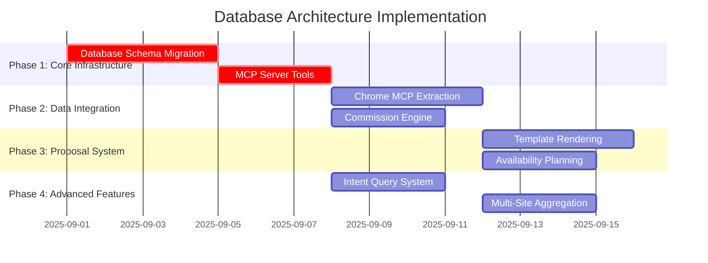

# TASK-003X: Database Architecture Implementation Overview
**Project**: Voygen Travel Assistant Database Architecture  
**Specification**: `.project/specs/database-architecture-specification.md`  
**Duration**: 4-5 weeks  
**Priority**: Critical  

## Executive Summary

This task coordination file oversees the complete implementation of the ChatGPT database architecture recommendations for Voygen. The initiative transforms Voygen from a basic trip planning tool into a sophisticated, availability-first travel assistant with real-time data aggregation, intelligent commission optimization, and rapid proposal generation.

### **🎉 PHASE 1 COMPLETED SUCCESSFULLY - September 2, 2025**

**TASK-0031: Database Schema Migration** ✅ COMPLETE  
- All 6 migrations applied successfully
- Fact table system operational with triggers
- Comprehensive rollback procedures in place
- Schema version 6, all tables and indexes created

**TASK-0032: MCP Server Tools** ✅ COMPLETE  
- 9 new MCP tools implemented and deployed
- Hotel management: `ingest_hotels`, `ingest_rooms`, `query_hotels`
- Fact management: `query_trip_facts`, `mark_facts_dirty`, `get_facts_stats`
- Commission optimization: `configure_commission_rates`, `optimize_commission`, `calculate_trip_commission`
- Full Zod schema validation and error handling
- Successfully deployed to Cloudflare Workers

**Ready to proceed with Phase 2 implementation (Chrome MCP Data Extraction and Commission Engine).**

## Task Dependencies and Critical Path



## Task Breakdown

### **Phase 1: Core Infrastructure (Critical Path)**
Duration: 1-2 weeks

#### TASK-0031: Database Schema Migration
- **Priority**: Critical
- **Duration**: 3-4 days
- **Dependencies**: None
- **Key Deliverables**:
  - Hotel/room cache tables
  - Trip facts system with triggers
  - Commission configuration tables
  - Proposal generation tables
- **Success Criteria**: All migrations apply without errors, <100ms fact queries

#### TASK-0032: MCP Server Tools
- **Priority**: Critical  
- **Duration**: 2-3 days
- **Dependencies**: TASK-0031
- **Key Deliverables**:
  - `ingest_hotels` and `ingest_rooms` tools
  - `refresh_trip_facts` and `query_trip_facts` tools
  - Commission optimization tools
- **Success Criteria**: All tools pass validation, error handling complete

### **Phase 2: Data Extraction Integration (High Priority)**
Duration: 1 week

#### TASK-0033: Chrome MCP Data Extraction
- **Priority**: High
- **Duration**: 3-4 days
- **Dependencies**: TASK-0032
- **Key Deliverables**:
  - Site-specific extractors (Navitrip, Trisept, VAX)
  - Unified HotelOption data structure
  - Extraction session tracking
- **Success Criteria**: >95% extraction success rate, unified data format

#### TASK-0034: Commission Calculation Engine
- **Priority**: High
- **Duration**: 2-3 days
- **Dependencies**: TASK-0032
- **Key Deliverables**:
  - Rule-based commission engine
  - Refundable vs non-refundable optimization
  - Commission reporting tools
- **Success Criteria**: Accurate calculations, 10%+ commission optimization

### **Phase 3: Proposal Generation System (High Priority)**
Duration: 1 week

#### TASK-0035: Template Rendering Pipeline
- **Priority**: High
- **Duration**: 3-4 days
- **Dependencies**: TASK-0033
- **Key Deliverables**:
  - Nunjucks template system
  - Image download and optimization
  - PDF generation with Puppeteer
- **Success Criteria**: <30 second proposal generation, professional output

#### TASK-0036: Availability-First Planning
- **Priority**: Medium
- **Duration**: 2-3 days
- **Dependencies**: TASK-0033, TASK-0034
- **Key Deliverables**:
  - L/M/H hotel selection algorithm
  - Real-time availability checking
  - Smart recommendation engine
- **Success Criteria**: <60 second availability checks, accurate segmentation

### **Phase 4: Advanced Features (Medium Priority)**
Duration: 1 week

#### TASK-0037: Intent-Based Query System
- **Priority**: Medium
- **Duration**: 2-3 days
- **Dependencies**: TASK-0032
- **Key Deliverables**:
  - Intent classification system
  - Template query patterns
  - Admin SQL interface
- **Success Criteria**: >80% intent accuracy, <100ms template queries

#### TASK-0038: Multi-Site Data Aggregation
- **Priority**: Medium
- **Duration**: 2-3 days
- **Dependencies**: TASK-0033, TASK-0034
- **Key Deliverables**:
  - Parallel extraction workflows
  - Conflict resolution system
  - Site performance monitoring
- **Success Criteria**: 3x faster extraction, >95% duplicate detection

## Implementation Coordination

### **Critical Path Management**
1. **Phase 1 tasks (0031, 0032)** must complete before any Phase 2 work begins
2. **TASK-0032** is a dependency for multiple downstream tasks
3. **TASK-0033** enables both Phase 3 tasks and TASK-0038
4. **TASK-0034** is required for commission-related features in later phases

### **Parallel Work Opportunities**
- **TASK-0033** and **TASK-0034** can be worked simultaneously after Phase 1
- **TASK-0037** can begin as soon as **TASK-0032** completes
- **TASK-0035** and **TASK-0036** can overlap in their later stages
- **TASK-0038** requires completion of both **TASK-0033** and **TASK-0034**

### **Resource Allocation**
- **Database Developer**: Focus on TASK-0031, then support TASK-0032
- **Backend Developer**: Lead TASK-0032, then TASK-0033 and TASK-0034
- **Frontend Integration**: Handle TASK-0035 and integration testing
- **QA/Testing**: Begin with TASK-0031, continuous testing through all phases

## Risk Management

### **High-Risk Dependencies**
1. **Database Migration (TASK-0031)**: Any failures block all subsequent work
   - **Mitigation**: Extensive testing, rollback procedures
   
2. **MCP Tool Implementation (TASK-0032)**: Core functionality for all features
   - **Mitigation**: Incremental development, comprehensive testing

3. **Site Extraction Reliability (TASK-0033)**: External dependencies
   - **Mitigation**: Robust error handling, fallback mechanisms

### **Performance Risks**
- Database triggers impacting write performance
- Image processing consuming excessive resources
- Parallel extractions causing rate limiting
- Large fact table queries slowing system

### **Data Quality Risks**
- Inconsistent data between normalized and denormalized tables
- Commission calculation errors affecting business
- Proposal generation failures

## Success Metrics

### **Technical Metrics**
- Database query performance: <100ms for fact table queries
- Extraction success rate: >95% across all sites
- Commission calculation accuracy: <1% variance
- Proposal generation time: <30 seconds end-to-end

### **Business Metrics**
- Proposal creation time: Reduce from hours to <30 minutes
- Commission optimization: 10-15% increase in average commission
- Agent productivity: 3x faster trip planning
- System availability: >99.5% uptime

## Testing Strategy

### **Progressive Testing Approach**
1. **Unit Testing**: Each task includes comprehensive unit tests
2. **Integration Testing**: Test interactions between completed tasks
3. **System Testing**: End-to-end workflows after Phase 3
4. **Performance Testing**: Load testing after each phase
5. **User Acceptance Testing**: Agent workflow validation

### **Testing Milestones**
- **End of Phase 1**: Database integrity and MCP tool functionality
- **End of Phase 2**: Data extraction and commission calculation accuracy
- **End of Phase 3**: Complete proposal generation workflow
- **End of Phase 4**: Advanced query and aggregation features

## Communication and Reporting

### **Daily Standups**
- Progress on current tasks
- Blockers and dependencies
- Risk identification
- Resource needs

### **Weekly Status Reports**
- Task completion status
- Performance metrics achieved
- Risk assessment updates
- Resource utilization

### **Phase Completion Reviews**
- Deliverable acceptance
- Success criteria validation
- Lessons learned
- Next phase preparation

## Rollback and Contingency Plans

### **Database Rollback**
- All new tables are independent of existing schema
- Triggers can be disabled without affecting core functionality
- Schema version tracking enables automated rollback

### **Feature Rollback**
- Feature flags for gradual rollout
- Ability to disable new MCP tools
- Fallback to existing functionality

### **Performance Contingency**
- Database performance monitoring with alerts
- Graceful degradation for slow queries
- Circuit breakers for external site extractions

## Post-Implementation

### **Monitoring and Maintenance**
- Database performance metrics
- Site extraction success rates
- Commission calculation accuracy
- User adoption and feedback

### **Documentation Updates**
- API documentation for new MCP tools
- User guides for new features
- Troubleshooting guides
- Architecture decision records

### **Future Enhancements**
- Additional travel booking sites
- Advanced AI-powered recommendations
- Mobile app integration
- Real-time collaboration features

---

## **Next Steps to Begin Implementation**

1. **Environment Setup**:
   ```bash
   cd /home/neil/dev/voygen
   git checkout -b feature/database-architecture
   ```

2. **Start with TASK-0031**:
   - Review database schema migration task
   - Set up development database for testing
   - Begin migration script development

3. **Team Coordination**:
   - Assign team members to specific tasks
   - Set up task tracking in project management tool
   - Schedule daily standups for coordination

4. **Success Tracking**:
   - Implement metrics collection for success criteria
   - Set up monitoring dashboards
   - Define acceptance criteria for each deliverable

**This overview file should be referenced daily during implementation to ensure all tasks stay coordinated and on track toward the 4-5 week completion goal.**