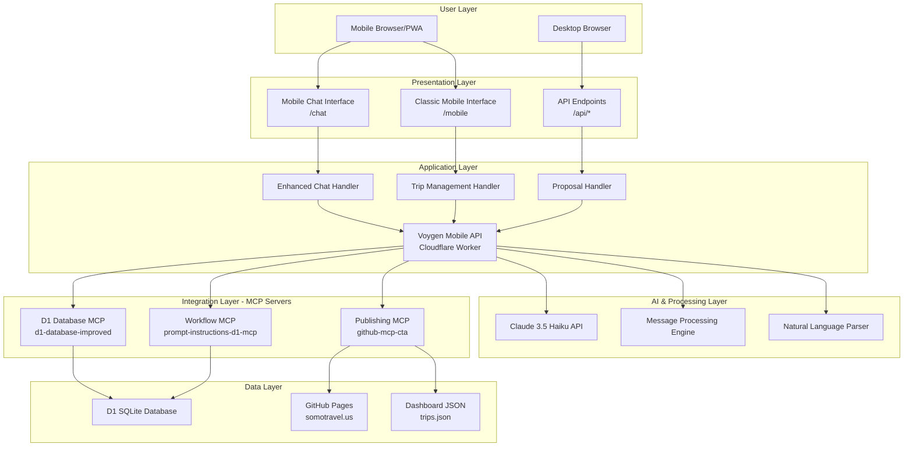

# Voygen Mobile Architecture Documentation

## System Overview

The Voygen Mobile Travel Assistant is built as a distributed system using Cloudflare Workers, with a progressive web app frontend and full MCP (Model Context Protocol) server integration.

## Architecture Diagram



## Component Breakdown

### Frontend Components

#### 1. Mobile Chat Interface (`/chat`)
**Technology**: Progressive Web App (PWA)
- **Framework**: Vanilla JavaScript with modern ES6+
- **UI Library**: Custom CSS with mobile-first responsive design
- **Features**:
  - Real-time chat interface with typing indicators
  - Context-aware conversation memory
  - Quick action buttons for common tasks
  - Offline-capable for viewing recent conversations
  - Voice input ready (future enhancement)

**Key Files**:
```
src/templates/mobile-chat.ts    # HTML template and JavaScript
src/handlers/enhanced-chat.ts   # Backend chat processing
```

#### 2. Classic Mobile Interface (`/mobile`)
**Technology**: Server-side rendered HTML
- **Framework**: Template-based rendering
- **UI Library**: Bootstrap-inspired custom CSS
- **Features**:
  - Traditional CRUD forms
  - Trip listing and basic management
  - Fast loading for quick edits
  - Minimal JavaScript dependencies

**Key Files**:
```
src/templates/mobile.ts         # HTML template
src/handlers/trips.ts          # Trip CRUD operations
src/handlers/proposals.ts      # Proposal generation
```

### Backend Architecture

#### 1. Cloudflare Worker Runtime
**Platform**: Cloudflare Workers (V8 Runtime)
- **Language**: TypeScript compiled to JavaScript
- **Execution**: Edge computing with global distribution
- **Scaling**: Auto-scaling with 0ms cold starts
- **Memory**: 128MB limit per request

**Configuration**:
```toml
# wrangler.toml
name = "voygen-mobile-api"
main = "src/index.ts"
compatibility_date = "2025-01-20"
compatibility_flags = ["nodejs_compat"]
```

#### 2. Request Routing System
```typescript
// URL Pattern Matching
const routes = {
  'GET /chat': 'Enhanced chat interface',
  'GET /mobile': 'Classic mobile interface', 
  'POST /chat/enhanced': 'AI chat with MCP integration',
  'GET|POST|PATCH /trips': 'Trip CRUD operations',
  'POST /publish/:id': 'Trip publishing'
}
```

#### 3. Authentication Layer
**Method**: Bearer Token Authentication
```typescript
interface AuthResult {
  success: boolean;
  owner?: string;
  error?: string;
}

// Implementation
const authenticate = (request: Request, env: Env): AuthResult => {
  const authHeader = request.headers.get('Authorization');
  const token = authHeader?.replace('Bearer ', '');
  return token === env.AUTH_SECRET 
    ? { success: true, owner: 'mobile-user' }
    : { success: false, error: 'Invalid token' };
}
```

### AI Processing Engine

#### 1. Natural Language Processing Pipeline
```typescript
async function processUserMessage(message: string, context: any, env: Env) {
  // 1. Intent Recognition
  const intent = classifyIntent(message);
  
  // 2. Entity Extraction  
  const entities = extractEntities(message);
  
  // 3. MCP Server Routing
  const mcpResponse = await callMCPServer(intent, entities);
  
  // 4. Response Formatting
  return formatResponse(mcpResponse, context);
}
```

**Intent Classification**:
- Trip management (create, read, update, delete)
- Client queries (search, details, history)
- Workflow operations (continue, advance, status)
- Publishing operations (generate, publish, update)
- General AI assistance (questions, help, guidance)

#### 2. Claude API Integration
**Model**: Claude 3.5 Haiku
- **Cost**: $0.25 per 1M input tokens, $1.25 per 1M output tokens
- **Context**: 200K tokens (≈150K words)
- **Response**: 4K tokens max
- **Latency**: 2-5 seconds average

```typescript
const claudeRequest = {
  model: 'claude-3-5-haiku-20241022',
  max_tokens: 1024,
  messages: [{
    role: 'user',
    content: `Context: ${tripContext}\nUser: ${message}`
  }],
  system: `You are Voygen, an AI travel assistant...`
}
```

### MCP Server Integration

#### 1. Database MCP Server
**URL**: `https://d1-database-improved.somotravel.workers.dev/sse`
**Protocol**: JSON-RPC 2.0 over Server-Sent Events

**Key Operations**:
```typescript
// Search operations
await callMCPServer(dbUrl, 'get_anything', {
  query: searchTerms,
  include_everything: true
});

// Trip creation
await callMCPServer(dbUrl, 'create_trip_with_client', {
  trip_name, client_full_name, client_email,
  destinations, start_date, end_date, status
});

// Bulk operations
await callMCPServer(dbUrl, 'bulk_trip_operations', {
  trip_identifier, operations: [...]
});
```

#### 2. Workflow MCP Server  
**URL**: `https://prompt-instructions-d1-mcp.somotravel.workers.dev/sse`

**Key Operations**:
```typescript
// Resume workflow
await callMCPServer(workflowUrl, 'continue_trip', {
  search_query: tripIdentifier
});

// Workflow status
await callMCPServer(workflowUrl, 'get_workflow_status', {
  trip_identifier: tripId
});
```

#### 3. Publishing MCP Server
**URL**: `https://github-mcp-cta.somotravel.workers.dev/sse`

**Key Operations**:
```typescript
// Publish with dashboard update
await callMCPServer(publishUrl, 'publish_travel_document_with_dashboard_update', {
  trip_id, html_content, filename, trip_metadata
});
```

### Data Layer Architecture

#### 1. D1 Database Schema
**Platform**: Cloudflare D1 (SQLite)
**Database ID**: `e6723f99-1d99-45bb-a941-e7600a56abe9`

**Core Tables**:
```sql
-- Trips
CREATE TABLE trips_v2 (
  trip_id INTEGER PRIMARY KEY,
  trip_name TEXT NOT NULL,
  status TEXT CHECK(status IN ('planning','confirmed','deposit_paid','paid_in_full','in_progress','completed','cancelled')),
  start_date DATE,
  end_date DATE,
  destinations TEXT,
  total_cost REAL DEFAULT 0,
  -- JSON columns
  clients TEXT,           -- JSON array of client objects
  schedule TEXT,          -- JSON array of schedule items  
  accommodations TEXT,    -- JSON array of accommodation objects
  transportation TEXT,    -- JSON array of transport objects
  financials TEXT,        -- JSON object of financial details
  documents TEXT,         -- JSON array of document references
  notes TEXT,
  created_at DATETIME DEFAULT CURRENT_TIMESTAMP,
  updated_at DATETIME DEFAULT CURRENT_TIMESTAMP
);

-- Clients
CREATE TABLE clients_v2 (
  client_id INTEGER PRIMARY KEY,
  email TEXT UNIQUE NOT NULL,
  full_name TEXT NOT NULL,
  phone TEXT,
  address TEXT,
  -- JSON columns
  preferences TEXT,       -- JSON object of travel preferences
  loyalty_programs TEXT,  -- JSON object of loyalty memberships
  travel_docs TEXT,       -- JSON object of passport/visa info
  notes TEXT,
  created_at DATETIME DEFAULT CURRENT_TIMESTAMP,
  updated_at DATETIME DEFAULT CURRENT_TIMESTAMP
);

-- Trip-Client Associations
CREATE TABLE trip_clients (
  trip_id INTEGER,
  client_id INTEGER,
  role TEXT DEFAULT 'traveler',
  PRIMARY KEY (trip_id, client_id),
  FOREIGN KEY (trip_id) REFERENCES trips_v2(trip_id),
  FOREIGN KEY (client_id) REFERENCES clients_v2(client_id)
);
```

#### 2. Publishing Integration
**Platform**: GitHub Pages
**Domain**: somotravel.us

**File Structure**:
```
somotravel.us/
├── trips/
│   ├── paris-getaway-2024.html      # Published proposals
│   ├── london-adventure-2024.html
│   └── ...
├── assets/
│   ├── images/                      # Trip images
│   └── styles/                      # CSS templates
└── trips.json                       # Dashboard metadata
```

**Dashboard Integration**:
```json
{
  "trips": [
    {
      "title": "Paris Getaway 2024",
      "dates": "June 1-10, 2024", 
      "category": "proposal",
      "status": "planning",
      "filename": "paris-getaway-2024.html",
      "lastModified": "2024-01-15T13:00:00Z",
      "tags": ["paris", "romantic", "luxury"]
    }
  ]
}
```

## Deployment Architecture

### 1. Development Workflow
```bash
# Local development
npm run dev          # Start local dev server
npm run build        # Compile TypeScript
npm run test         # Run unit tests

# Deployment 
npm run deploy       # Deploy to Cloudflare Workers
```

### 2. Environment Configuration
```toml
# wrangler.toml
[vars]
AUTH_SECRET = "dev-secret"
ANTHROPIC_API_KEY = "sk-ant-api03-..."
MCP_AUTH_KEY = "your-secret-auth-key"
PUBLISH_MCP_URL = "https://github-mcp-cta.somotravel.workers.dev"
SITE_BASE_URL = "https://somotravel.us"

[[d1_databases]]
binding = "DB"
database_name = "travel_assistant"
database_id = "e6723f99-1d99-45bb-a941-e7600a56abe9"
```

### 3. Global Distribution
**Edge Locations**: 275+ Cloudflare data centers worldwide
**Latency**: < 100ms response time globally
**Availability**: 99.99+ SLA with automatic failover

## Performance Characteristics

### 1. Response Times
| Operation Type | Response Time | Notes |
|---------------|---------------|--------|
| Static pages | 50-100ms | Cached at edge |
| Trip CRUD | 200-500ms | Single DB query |
| Simple chat | 2-3 seconds | Claude API call |
| Complex chat | 5-10 seconds | Multiple MCP calls |
| Publishing | 10-15 seconds | GitHub API integration |

### 2. Scalability Limits
| Resource | Limit | Notes |
|----------|-------|--------|
| CPU Time | 30 seconds | Per request timeout |
| Memory | 128MB | Per request limit |
| Request Size | 100MB | Payload limit |
| Response Size | 25MB | Output limit |
| Concurrent Users | Unlimited | Auto-scaling |

### 3. Cost Analysis (Monthly)
| Component | Cost | Usage Assumption |
|-----------|------|------------------|
| Cloudflare Workers | $5-25 | 100K-1M requests |
| D1 Database | $0-5 | <100K operations |
| Claude API | $10-50 | 1K-10K messages |
| **Total** | **$15-80** | Typical agency usage |

## Security Architecture

### 1. Authentication & Authorization
```typescript
// Token-based authentication
const AUTH_SECRET = env.AUTH_SECRET;
const isAuthenticated = (token: string) => token === AUTH_SECRET;

// CORS configuration
const corsHeaders = {
  'Access-Control-Allow-Origin': '*',
  'Access-Control-Allow-Methods': 'GET,POST,PATCH,OPTIONS',
  'Access-Control-Allow-Headers': 'Content-Type,Authorization'
};
```

### 2. Data Protection
- **In Transit**: HTTPS/TLS 1.3 encryption
- **At Rest**: Cloudflare D1 encrypted storage  
- **API Keys**: Environment variable storage
- **Secrets**: Wrangler secrets management

### 3. Input Validation
```typescript
// Zod schema validation
const TripCreateSchema = z.object({
  trip_name: z.string().min(1),
  start_date: z.string().datetime(),
  end_date: z.string().datetime(),
  destinations: z.string().optional(),
  status: z.enum(['planning', 'confirmed', 'in_progress', 'completed']).optional()
});
```

## Monitoring & Observability

### 1. Built-in Metrics
- Request count and duration
- Error rates and types
- Memory usage and CPU time
- Geographic distribution of requests

### 2. Custom Logging
```typescript
// Structured logging
console.log(JSON.stringify({
  timestamp: new Date().toISOString(),
  level: 'INFO',
  operation: 'chat_enhanced',
  user: auth.owner,
  session_id: sessionId,
  processing_time_ms: duration,
  mcp_calls: mcpCallCount
}));
```

### 3. Health Monitoring
```typescript
// Health check endpoint
GET /health
{
  "status": "healthy",
  "version": "1.0.0-modular", 
  "database": "connected",
  "mcp_servers": {
    "database": "healthy",
    "workflow": "healthy", 
    "publishing": "healthy"
  },
  "response_time_ms": 45
}
```

## Future Architecture Considerations

### 1. Scaling Improvements
- **Caching Layer**: Redis for session state and frequent queries
- **CDN Integration**: Static asset optimization
- **Database Sharding**: Multiple D1 databases by region
- **Load Balancing**: Smart routing based on user location

### 2. Feature Enhancements
- **WebSocket Support**: Real-time collaboration features
- **Push Notifications**: Web Push API for trip updates
- **Offline Sync**: Service Worker with background sync
- **Multi-tenancy**: Support for multiple travel agencies

### 3. Integration Expansion
- **Payment Processing**: Stripe/PayPal integration
- **Calendar Sync**: Google Calendar/Outlook integration
- **CRM Integration**: Salesforce/HubSpot connectors
- **Communication**: SMS/Email automation

---

*Architecture Version: 2.0.0*  
*Last Updated: January 2025*