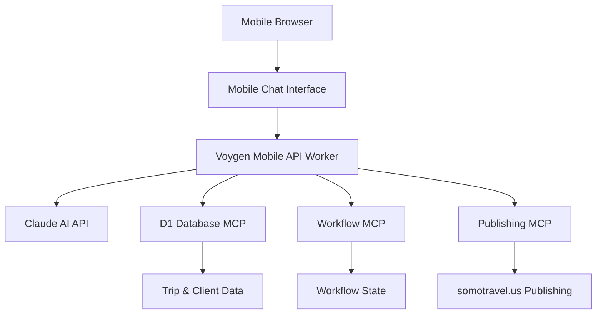

# Voygen Mobile Travel Assistant

## Overview

The Voygen Mobile Travel Assistant is a conversational AI interface designed for travel agents to manage trips, clients, and bookings from mobile devices. It provides a Claude/LibreChat-style chat experience with full integration to the Voygen MCP ecosystem.

## Quick Access

**🚀 Live Interface:** https://voygen-mobile-api.somotravel.workers.dev/chat

**Authentication Token:** `dev-secret`

## Key Features

### 🤖 **Conversational AI Interface**
- Natural language chat with Claude-powered responses
- Context-aware conversations about specific trips and clients
- Mobile-optimized chat UI with typing indicators and smooth animations
- Quick action buttons for common tasks

### 🔗 **Full MCP Integration**
- **Database Access**: Direct queries to D1 database via `d1-database-improved.somotravel.workers.dev`
- **Workflow Management**: Resume and advance trip workflows via `prompt-instructions-d1-mcp.somotravel.workers.dev`
- **Document Publishing**: Generate and publish proposals via `github-mcp-cta.somotravel.workers.dev`

### 📱 **Mobile-First Design**
- Responsive design optimized for phones and tablets
- Touch-friendly interface with large buttons and easy navigation
- Offline-ready progressive web app capabilities
- Fast loading and smooth interactions

## What You Can Do

### Trip Management
```
"Show me all my trips"
"Find trips for John Smith"
"What's the status of the Paris trip?"
"Continue working on the Barcelona booking"
```

### Trip Creation
```
"Create a trip for John Smith (john@email.com) to Paris from June 1-10 called Paris Getaway"
"Add a new London trip for Sarah and Michael"
"Set up a booking for the Johnson family to Italy"
```

### Publishing & Proposals
```
"Publish the Paris trip proposal"
"Generate proposal for trip 123"
"Create and publish the latest booking"
```

### General Assistance
```
"Help me with travel planning"
"What are my pending trips?"
"Show me recent activity"
"What can you help me with?"
```

## Architecture Overview



## Interfaces Available

### 1. Enhanced Chat Interface (`/chat`)
**Primary mobile experience** - Full conversational AI with MCP integration
- Claude-powered responses with full context
- Natural language trip and client management
- Workflow continuation and publishing
- Mobile-optimized chat UI

### 2. Classic Mobile Interface (`/` or `/mobile`)
**Basic CRUD interface** - Traditional form-based management
- Trip listing and basic details
- Simple trip creation forms
- Limited AI responses (fallback only)
- Good for quick data entry

### 3. API Endpoints (`/api/*`)
**Programmatic access** - For integration with other systems
- RESTful API for trips and clients
- Proposal generation and publishing
- Authentication via Bearer tokens

## Technical Stack

- **Frontend**: Progressive Web App (PWA) with vanilla JavaScript
- **Backend**: Cloudflare Workers with TypeScript
- **Database**: D1 SQLite database via MCP server
- **AI**: Claude 3.5 Haiku via Anthropic API
- **Publishing**: GitHub Pages integration
- **Authentication**: Bearer token authentication

## Quick Start Guide

### For Travel Agents

1. **Access the Interface**
   - Visit: https://voygen-mobile-api.somotravel.workers.dev/chat
   - Enter token: `dev-secret`
   - Tap "Connect to Voygen"

2. **Start Chatting**
   - Try the suggested prompts or type naturally
   - Ask about existing trips: "Show me all my trips"
   - Create new trips: "Create a trip for [client] to [destination]"
   - Publish proposals: "Publish the [trip name] proposal"

3. **Use Quick Actions**
   - Tap the quick action buttons for common tasks
   - 📋 Show Trips | ➕ New Trip | ▶️ Continue | 🚀 Publish

### For Developers

1. **Local Development**
   ```bash
   cd remote-mcp-servers/voygen-mobile-api
   npm install
   npm run dev
   ```

2. **Deployment**
   ```bash
   npm run build
   npm run deploy
   ```

3. **Configuration**
   - Edit `wrangler.toml` for environment variables
   - Update MCP server URLs as needed
   - Configure authentication tokens

## Configuration

### Environment Variables

Required in `wrangler.toml`:
```toml
[vars]
AUTH_SECRET = "dev-secret"
ANTHROPIC_API_KEY = "your-claude-api-key"
MCP_AUTH_KEY = "your-mcp-auth-key"
PUBLISH_MCP_URL = "https://github-mcp-cta.somotravel.workers.dev"
SITE_BASE_URL = "https://somotravel.us"
```

### MCP Server Endpoints

The mobile assistant connects to these MCP servers:
- **Database**: `https://d1-database-improved.somotravel.workers.dev/sse`
- **Workflows**: `https://prompt-instructions-d1-mcp.somotravel.workers.dev/sse`  
- **Publishing**: `https://github-mcp-cta.somotravel.workers.dev/sse`

## Comparison: Mobile Interfaces

| Feature | Enhanced Chat (`/chat`) | Classic Mobile (`/mobile`) |
|---------|------------------------|---------------------------|
| **UI Style** | Conversational chat | Traditional forms |
| **AI Integration** | Full Claude API | Basic fallback only |
| **MCP Servers** | All 3 servers | Database only |
| **Trip Management** | Natural language | CRUD forms |
| **Workflow Support** | Full continuation | None |
| **Publishing** | One-command | Manual process |
| **Mobile UX** | Optimized chat | Basic responsive |
| **Best For** | Daily agent use | Quick data entry |

## Support & Troubleshooting

### Common Issues

**"Authentication failed"**
- Ensure you're using the correct token: `dev-secret`
- Check that the token is entered exactly (case-sensitive)

**"Server error" responses**
- Check MCP server status at their endpoints
- Verify environment variables are set correctly
- Review Cloudflare Workers logs

**Slow responses**
- Normal for complex queries involving multiple MCP servers
- Typing indicator shows the system is working
- Consider using quick actions for common tasks

### Getting Help

- **API Health Check**: https://voygen-mobile-api.somotravel.workers.dev/health
- **Available Endpoints**: Check the health endpoint for current API status
- **Logs**: View Cloudflare Workers logs for debugging
- **MCP Status**: Test individual MCP server endpoints

## Future Enhancements

### Planned Features
- **Voice Input**: Speech-to-text for hands-free operation
- **Offline Mode**: Cache recent trips for offline access
- **Push Notifications**: Alerts for trip updates and deadlines
- **Photo Integration**: Attach photos to trips and proposals
- **Multi-language**: Support for international travel agents

### Integration Opportunities  
- **Calendar Sync**: Integration with Google Calendar/Outlook
- **CRM Integration**: Connect with existing customer management systems
- **Payment Processing**: Direct integration with payment gateways
- **SMS Notifications**: Text message updates for clients

## Developer Resources

- **Source Code**: `remote-mcp-servers/voygen-mobile-api/`
- **API Documentation**: [API_DOCUMENTATION.md](API_DOCUMENTATION.md)
- **User Guide**: [MOBILE_USER_GUIDE.md](MOBILE_USER_GUIDE.md)
- **Architecture**: [MOBILE_ARCHITECTURE.md](MOBILE_ARCHITECTURE.md)

---

*Last updated: January 2025*
*Version: 2.0.0 - Enhanced Chat Integration*