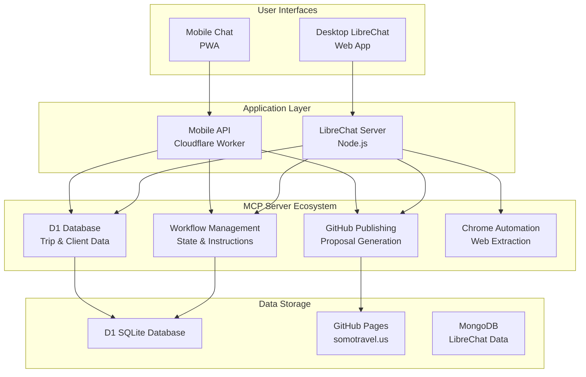

# Voygen Documentation

## Overview

Welcome to the Voygen documentation. Voygen is an AI-powered travel assistant system with both desktop and mobile interfaces, built on LibreChat with full Model Context Protocol (MCP) integration.

## Quick Access

### 🚀 Live Interfaces
- **Mobile Chat Interface**: https://voygen-mobile-api.somotravel.workers.dev/chat
- **Desktop LibreChat**: (requires local setup - see main README)
- **GitHub Pages Publishing**: https://somotravel.us

### 🔐 Authentication
- **Mobile Token**: `dev-secret`
- **API Access**: Bearer token authentication

## Documentation Index

### Mobile Travel Assistant
- **[📱 Mobile Travel Assistant Overview](MOBILE_TRAVEL_ASSISTANT.md)** - Main mobile interface documentation
- **[📖 Mobile User Guide](MOBILE_USER_GUIDE.md)** - Complete user guide for travel agents
- **[🔧 Mobile API Documentation](MOBILE_API_DOCUMENTATION.md)** - API endpoints and integration details
- **[🏗️ Mobile Architecture](MOBILE_ARCHITECTURE.md)** - Technical architecture and deployment

### MCP Chrome Integration  
- **[🌐 MCP Chrome Architecture](MCP_CHROME_ARCHITECTURE.md)** - Browser automation system
- **[⚙️ MCP Chrome Setup Guide](MCP_CHROME_SETUP_GUIDE.md)** - Installation and configuration
- **[🔍 MCP Chrome Troubleshooting](MCP_CHROME_TROUBLESHOOTING.md)** - Common issues and solutions

### Remix System
- **[🎨 Remix System Documentation](REMIX_SYSTEM_DOCUMENTATION.md)** - Template and theming system

### Data Extraction
- **[📊 Extractors](EXTRACTORS.md)** - Web data extraction tools

## Getting Started

### For Travel Agents (Mobile)
1. **Access the mobile interface**: https://voygen-mobile-api.somotravel.workers.dev/chat
2. **Enter token**: `dev-secret`
3. **Start chatting**: Try "Show me all my trips" or use quick action buttons
4. **Read the user guide**: [Mobile User Guide](MOBILE_USER_GUIDE.md)

### For Developers
1. **Review architecture**: [Mobile Architecture](MOBILE_ARCHITECTURE.md)
2. **Check API docs**: [Mobile API Documentation](MOBILE_API_DOCUMENTATION.md)  
3. **Local development**: See main project README.md
4. **Deployment**: Individual MCP servers can be deployed independently

## Feature Comparison

| Feature | Desktop (LibreChat) | Mobile Chat Interface |
|---------|--------------------|-----------------------|
| **Platform** | Desktop browser | Mobile-optimized PWA |
| **AI Model** | Multiple models | Claude 3.5 Haiku |
| **MCP Integration** | All servers | All servers |
| **Browser Automation** | Full mcp-chrome | Limited (future) |
| **Trip Management** | Full CRUD | Natural language + CRUD |
| **Publishing** | Multi-step process | One-command publishing |
| **Offline Support** | Limited | Conversation history |
| **Best For** | Complex workflows | On-the-go management |

## System Architecture Overview



## Development Workflow

### 1. Local Development
```bash
# Clone repository
git clone [repository-url]
cd voygen

# Install dependencies
npm run install-deps

# Start development servers
npm run dev                    # LibreChat development
cd remote-mcp-servers/voygen-mobile-api
npm run dev                    # Mobile API development
```

### 2. Testing
```bash
# Test MCP servers
npm run test:mcp

# Test mobile API
cd remote-mcp-servers/voygen-mobile-api
npm test

# Integration tests
npm run test:integration
```

### 3. Deployment
```bash
# Deploy all MCP servers
npm run deploy:mcp

# Deploy specific server
cd remote-mcp-servers/voygen-mobile-api
npm run deploy
```

## Support & Contributing

### Getting Help
- **Mobile Issues**: Check [Mobile User Guide](MOBILE_USER_GUIDE.md) troubleshooting section
- **API Issues**: Review [Mobile API Documentation](MOBILE_API_DOCUMENTATION.md) error responses
- **Architecture Questions**: See [Mobile Architecture](MOBILE_ARCHITECTURE.md)
- **MCP Chrome Issues**: Check [MCP Chrome Troubleshooting](MCP_CHROME_TROUBLESHOOTING.md)

### Health Checks
- **Mobile API**: https://voygen-mobile-api.somotravel.workers.dev/health
- **Database MCP**: https://d1-database-improved.somotravel.workers.dev/health
- **Publishing MCP**: https://github-mcp-cta.somotravel.workers.dev/health

### Contributing
1. **Read the architecture docs** to understand the system
2. **Check existing issues** in the repository
3. **Test thoroughly** with both mobile and desktop interfaces
4. **Update documentation** for any API or architecture changes

## Roadmap

### Short Term (Q1 2025)
- [ ] Voice input for mobile interface
- [ ] Offline sync for trip data
- [ ] Push notifications for trip updates
- [ ] Enhanced error handling and recovery

### Medium Term (Q2-Q3 2025)
- [ ] Multi-tenant support for multiple agencies
- [ ] Advanced workflow automation
- [ ] Payment processing integration
- [ ] Calendar synchronization

### Long Term (Q4 2025+)
- [ ] Native mobile apps (iOS/Android)
- [ ] Advanced AI agents for complex trip planning
- [ ] Real-time collaboration features
- [ ] International expansion support

---

*Last updated: January 2025*  
*Documentation version: 2.0.0*